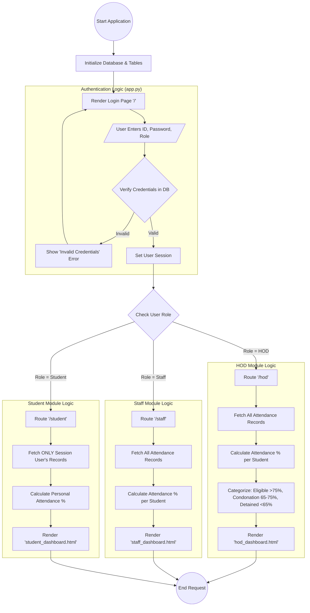

# Code Logic Flowchart (Based on app.py)

This flowchart represents exactly how the Python code (`app.py`) processes user requests, handles authentication, and retrieves data for each dashboard.

```mermaid
flowchart TD
    %% Start
    Start((Start Application)) --> InitDB[Initialize Database & Tables]
    InitDB --> LoginRoute[Render Login Page '/']

    %% Login Process
    subgraph "Authentication Logic (app.py)"
    LoginRoute --> UserInput[/User Enters ID, Password, Role/]
    UserInput --> CheckCreds{Verify Credentials in DB}
    
    CheckCreds -- Invalid --> ErrorMsg[Show 'Invalid Credentials' Error]
    ErrorMsg --> LoginRoute
    
    CheckCreds -- Valid --> SetSession[Set User Session]
    end

    %% Role Routing
    SetSession --> CheckRole{Check User Role}

    %% HOD Flow
    CheckRole -- Role = HOD --> HOD_Route[Route '/hod']
    subgraph "HOD Module Logic"
    HOD_Route --> FetchAllHOD[Fetch All Attendance Records]
    FetchAllHOD --> CalcStatsHOD[Calculate Attendance % per Student]
    CalcStatsHOD --> Categorize[Categorize: Eligible >75%, Condonation 65-75%, Detained <65%]
    Categorize --> RenderHOD[Render 'hod_dashboard.html']
    end

    %% Staff Flow
    CheckRole -- Role = Staff --> Staff_Route[Route '/staff']
    subgraph "Staff Module Logic"
    Staff_Route --> FetchAllStaff[Fetch All Attendance Records]
    FetchAllStaff --> CalcStatsStaff[Calculate Attendance % per Student]
    CalcStatsStaff --> RenderStaff[Render 'staff_dashboard.html']
    end

    %% Student Flow
    CheckRole -- Role = Student --> Student_Route[Route '/student']
    subgraph "Student Module Logic"
    Student_Route --> FetchSelf[Fetch ONLY Session User's Records]
    FetchSelf --> CalcSelf[Calculate Personal Attendance %]
    CalcSelf --> RenderStudent[Render 'student_dashboard.html']
    end

    %% End States
    RenderHOD --> Stop((End Request))
    RenderStaff --> Stop
    RenderStudent --> Stop
```
