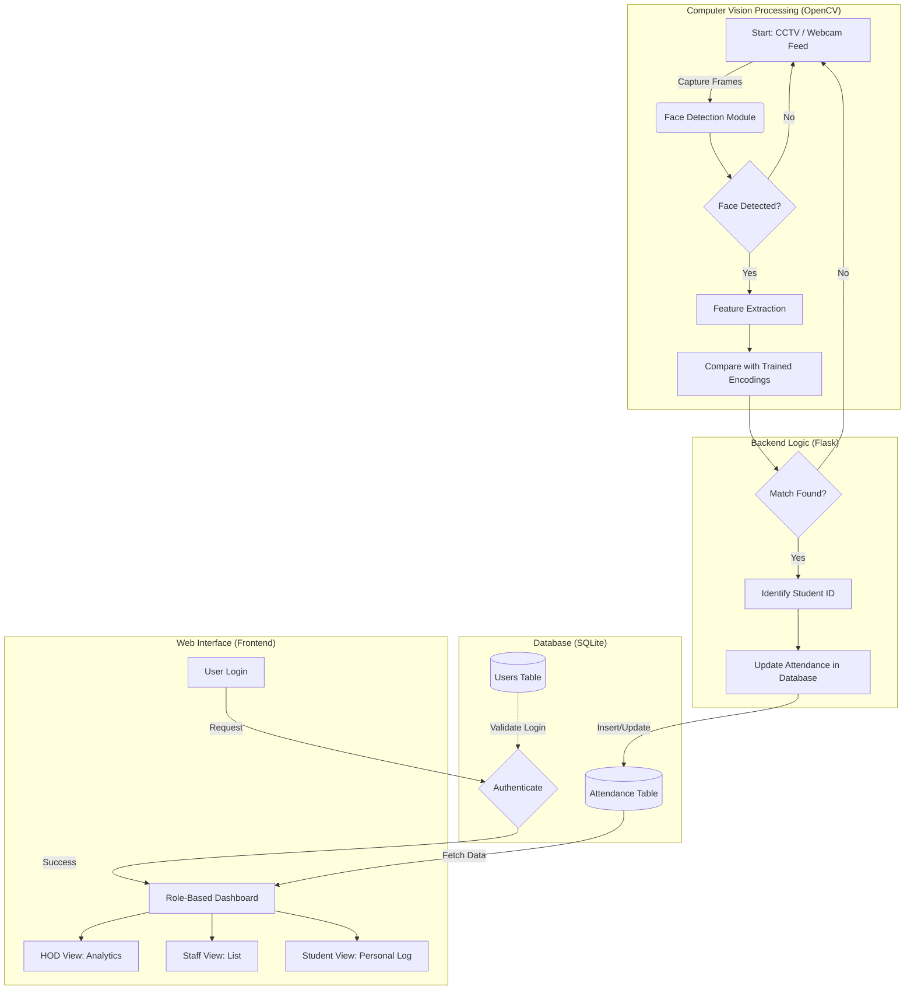
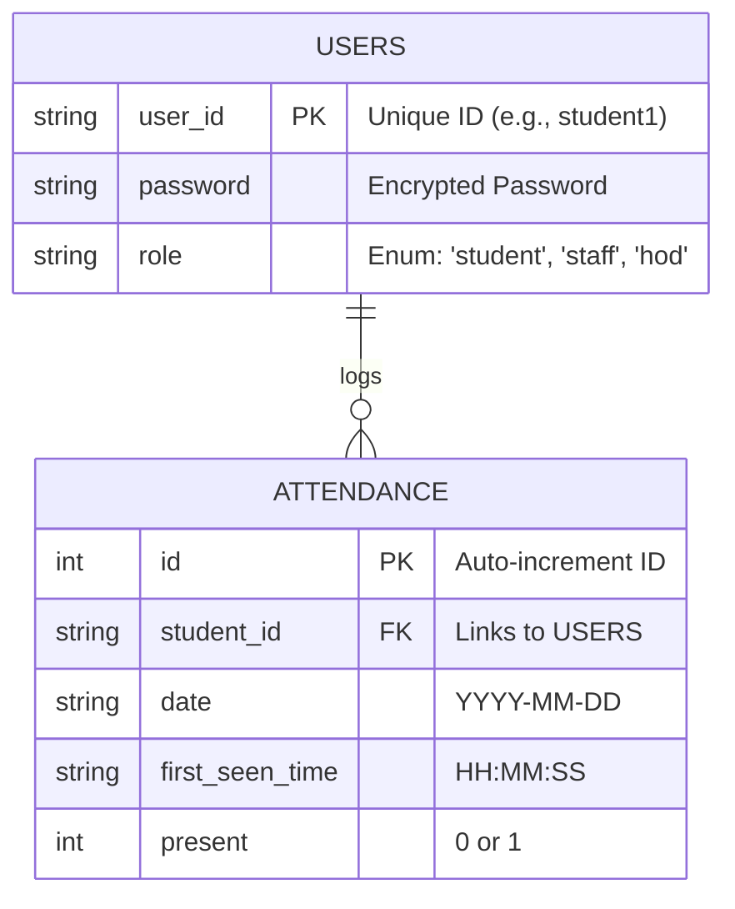

# Proposed System Diagrams

You can copy the **Mermaid** code below into any Mermaid editor (like [Mermaid Live Editor](https://mermaid.live/)) to generate high-quality images for your PPT.

## 1. Proposed System Flow Chart
This flowchart demonstrates the end-to-end data flow from the camera feed to the user dashboards.

---

## 2. Entity-Relationship (ER) Diagram
This diagram illustrates the database structure designed to maintain data integrity.

